# Results running Brooklin

In this experiment we set out to test the performance and correctness of [Brooklin](https://github.com/linkedin/brooklin/) with two Kafka clusters located in two AWS regions: `us-east-1` (Virginia) and `eu-west-1` (Ireland).

We created specialized producer and consumer written in Go. The producer's responsibility is to generate messages in predefined format and configurable throughput and the consumer's responsibility is to verify message arrival and measure throughput and latency. Read more about the design in the [README](README.md) file.

## Setup

We use *Kubernetest* to spin up servers in both datacenters and set up the two kafka clusters as well as brooklin, producer and consumer.

* The producer runs in us-east-1, producing data to local kafka cluster.
* brooklin runs in eu-west-1, consuming from the cluster in us-east-1 and producing to the local kafka cluster in eu-west-1
* The consumer runs in eu-west-1, consuming messages replicated to the local cluster by brooklin

Tests were run with this setup:

* Kubernetest node types: `i3-large`
* Kubernetest cluster sizes: in us-east-1: 20 nodes, in eu-west-1 35 nodes
* Kafka cluster sizes: 16 brokers in each cluster. Single zookeeper pod. Storage on ephemeral local ssd disks
* Brooklin: 32 workers (with 2Gib ram and 700 mili-cpu)
* Producer: 10 pods
* Consumer: 8 pods
* Produced message size: 1kB (1000 bytes) each message
* Production throughput: 200k messages/sec
* => This results in replication of *200 MB/sec*
* Number of replicated topics by Brooklin: 1
* Kafka replication factor: 2
* Partitions: 64 partitions on both clusters as a baseline

(further configuration details such as memory, CPU allocation and more can be found in the k8s yaml files in this project)

## Results

We ran multiple experiments, here are the highlights

### Experiment: Long haul

Run the workload of 200MB/sec for several hours.

**Result:** Looks good. Nothing suspicious happenes. Over hours and hours the topics were correctly replicated.

### Experiment: Kill a broker in kafka-source (aka kafka source node flapping)

We kill a broker pod in kafka-source. When killed k8s automatically re-provisions a new pod in the statefulset, which results in about a minute or less downtime for one of the brokers. Since replication factor is 2 we do not expect message loss although this action might result in higher latency and lower throughput.

Killing a pod: (example)

```sh
kubectl --context us-east-1.k8s.local -n kafka-source delete pod kafka-source-14
```

**Result:** We see a small hiccup in throughput and latency of replication. *No message loss*

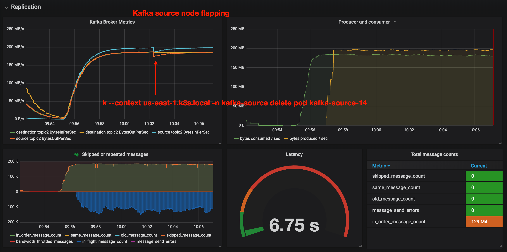

### Experiment: Kill a broker in kafka-destination (aka kafka destination node flapping)

We kill a broker pod in kafka-destination. As before, when killed, k8s automatically re-provisions a new pod. Since replication factor is 2 we do not expect message loss although this action might result in higher latency and lower throughput. 

Killing a pod: (example)

```sh
kubectl --context eu-west-1.k8s.local -n kafka-destination delete po kafka-destination-12
```

**Result:** This seems very problematic. There were several different effects, not all of them get repeated with each and every run, but all in all things don't look good.

#### Failure type 1: storm of errors

In some cases we see a storm of errors and warnings in brooklin up to a complete halt of replication. After around 5 minutes the brooklin workers get a grip and return to normal operation. All except for (typically, possibly) one worker, which continues in its error loop. Forcibly restarting the brooklin worker(s) seem to resolve this issue much faster than letting them try to recover by themselves...

Due to the long time it takes brooklin to recover, and due to the 5 minutes message retention configured on kafka-source, we see a significant loss of message. This experiment will be repeated with higher message retention in order to validate whether there's true message loss or not.

Here are some of the exceptions seen in the brooklin worker logs during this experiment:

```text
ERROR updateErrorRate with 1. Look for error logs right before this message to see what happened (com.linkedin.datastream.connectors.kafka.mirrormaker.KafkaMirrorMakerConnectorTask)

WARN Detect exception being thrown from callback for src partition: topic2-41 while sending, metadata: Checkpoint: topic2/41/12911485, Topic: topic2, Partition: 41 , exception:  (com.linkedin.datastream.connectors.kafka.mirrormaker.KafkaMirrorMakerConnectorTask)
 com.linkedin.datastream.server.api.transport.SendFailedException: com.linkedin.datastream.common.DatastreamRuntimeException: org.apache.kafka.common.KafkaException: Producer is closed forcefully.
 	at com.linkedin.datastream.server.EventProducer.onSendCallback(EventProducer.java:293)
 	at com.linkedin.datastream.server.EventProducer.lambda$send$0(EventProducer.java:194)
 	at com.linkedin.datastream.kafka.KafkaTransportProvider.doOnSendCallback(KafkaTransportProvider.java:189)
 	at com.linkedin.datastream.kafka.KafkaTransportProvider.lambda$send$0(KafkaTransportProvider.java:155)
 	at com.linkedin.datastream.kafka.KafkaProducerWrapper.lambda$null$0(KafkaProducerWrapper.java:198)
 	at org.apache.kafka.clients.producer.KafkaProducer$InterceptorCallback.onCompletion(KafkaProducer.java:1235)
 	at org.apache.kafka.clients.producer.internals.ProducerBatch.completeFutureAndFireCallbacks(ProducerBatch.java:204)
 	at org.apache.kafka.clients.producer.internals.ProducerBatch.abort(ProducerBatch.java:157)
 	at org.apache.kafka.clients.producer.internals.RecordAccumulator.abortBatches(RecordAccumulator.java:717)
 	at org.apache.kafka.clients.producer.internals.RecordAccumulator.abortBatches(RecordAccumulator.java:704)
 	at org.apache.kafka.clients.producer.internals.RecordAccumulator.abortIncompleteBatches(RecordAccumulator.java:691)
 	at org.apache.kafka.clients.producer.internals.Sender.run(Sender.java:185)
 	at java.lang.Thread.run(Thread.java:748)
 Caused by: com.linkedin.datastream.common.DatastreamRuntimeException: org.apache.kafka.common.KafkaException: Producer is closed forcefully.
 	at com.linkedin.datastream.kafka.KafkaProducerWrapper.generateSendFailure(KafkaProducerWrapper.java:251)
```

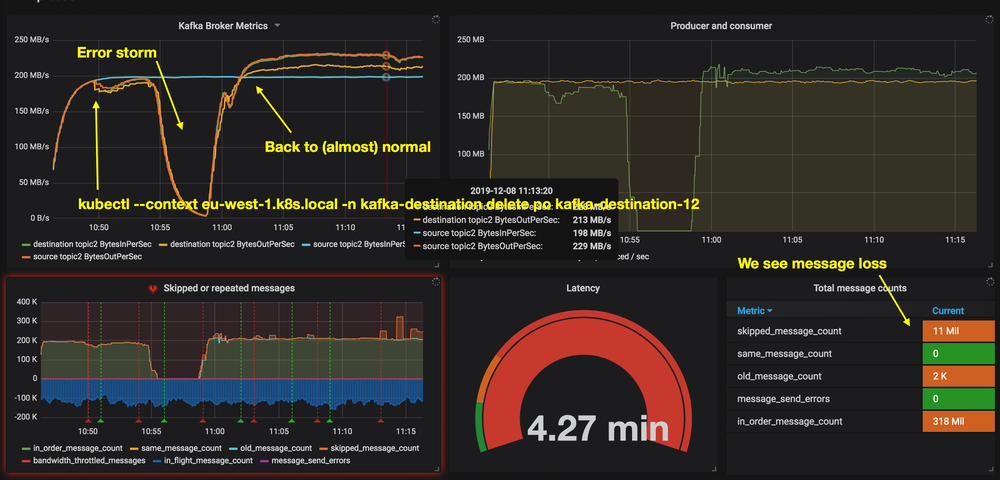

We repeat this experiment once again, this time with lower traffic (100mb/s), in hope that when the overall load, and in particular the load on brooklin workers, is lower, we hope to see higher recovery speed.

The result is again not great. We kill a single pod and then k8s revives it after less than a minute. And then we see a storm of errors in brooklin and several cycles of rebalance until a full recovery, up to around 15-20 minutes.

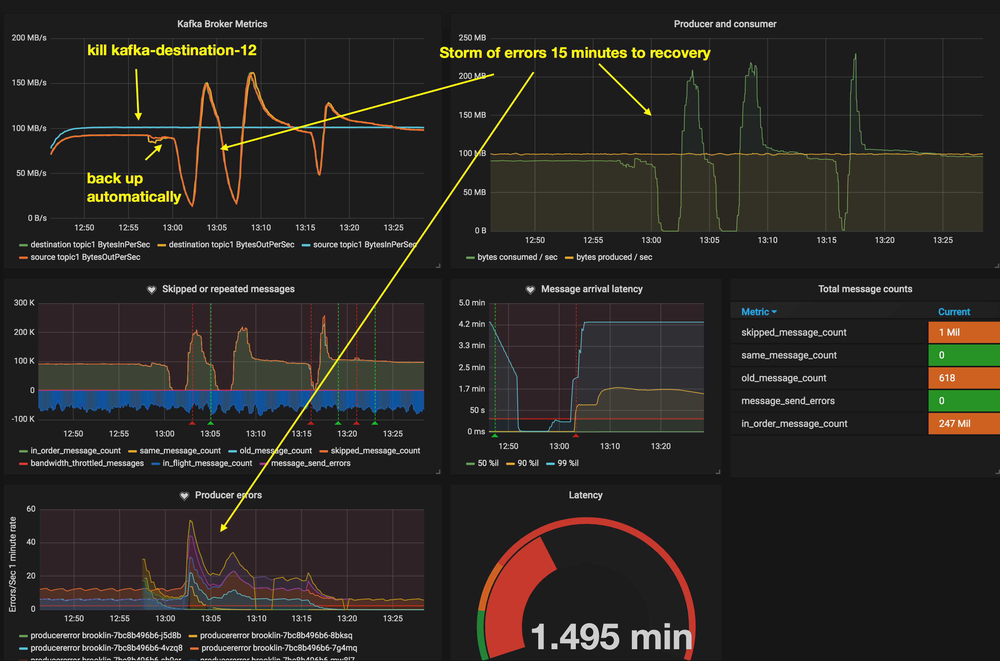


#### Failure type 2: small hiccup followed by ups and downs a high brooklin error rate

In a third attempt where we increase the retention of the messages in kafka-source, things start to look out better. We kill a pod in kafka-destination and see a small hiccup in replication latency, a small number of errors in brooklin logs and a small number of lost messages (can't explain this, sorry...) and then back to normal.

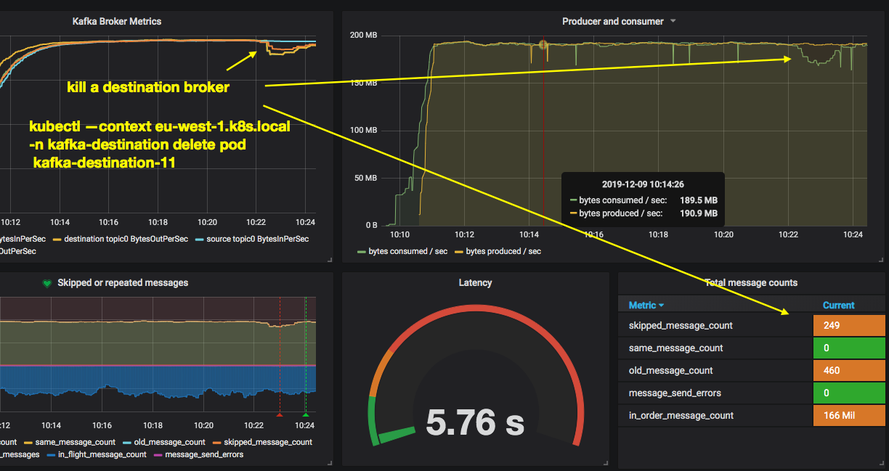

But then several minute later, we see an *after-shock*.

The first after-shock is manifested by slow replication and can be explained by the fact that kafka-destination-11 (the node that had been killed) is slow to recover, which slows everything down, including brooklin writes to it. 
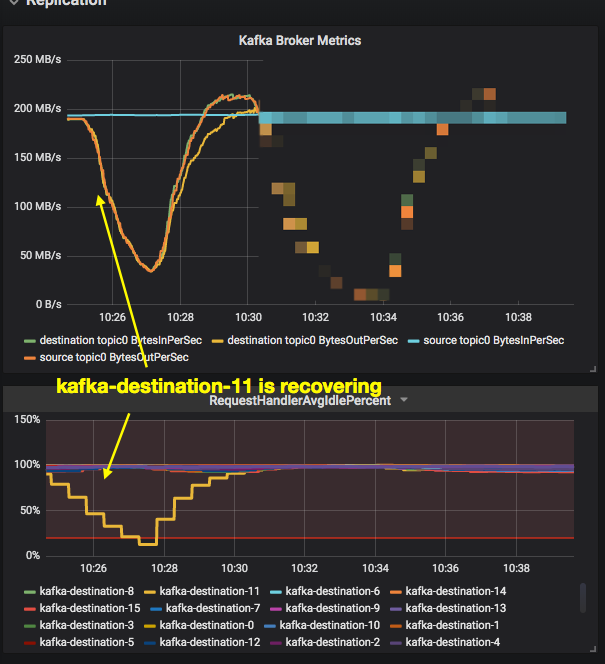

But aftershock 2 is actually even stranger. We see a *significant dip in replication* for several minutes without evident cause. After which replication goes back to normal. There is no data loss, but we also have no explanation of why this happens.

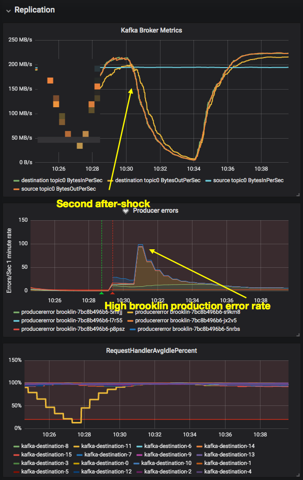

### Experiment: Downsize source cluster permanently to 15

The baseline of the source cluster is 16 brokers. In this experiment we reduce the size to 15 permanently. Unlike the previous experiment in this case k8s will not automatically re-provision the killed pod so the cluster size will remain 15 permanently. This is supposed to be OK since the replication factor is 2.

Scaling down a cluster to 15:

```sh
kubectl --context us-east-1.k8s.local -n kafka-source scale statefulset kafka-source --replicas 15
```

**Result:** the result is very similar to when a single host is down. We see a small hiccup and then back to normal.

We do see Kafka being busy re-replicating the partitions that were on the downsized broker, but brooklin itself seems fine in this scenario.

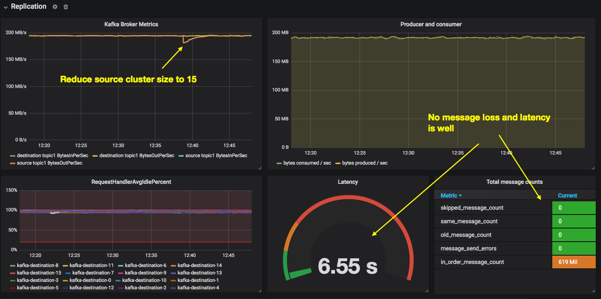

### Experiment: Downsize destination cluster permanently to 15

The baseline of the destination cluster is 16 brokers. In this experiment we reduce the size to 15 permanently. This is supposed to be OK since the replication factor is 2.

Scaling down a cluster to 15:

```sh
kubectl --context eu-west-1.k8s.local -n kafka-destination scale statefulset kafka-destination --replicas 15
```

**Result:** The result is not great :-(

Similar to the case of a broker flapping in the destination source, it seems that brooklin is not handling the case very well. We see a large dip in mirroring and a storm of errors, after which brooklin recovers, but we do see non-negligible message loss (in this case 400k messages, which equal to about 2 second of message production). We also see possible 1k messages replayed.

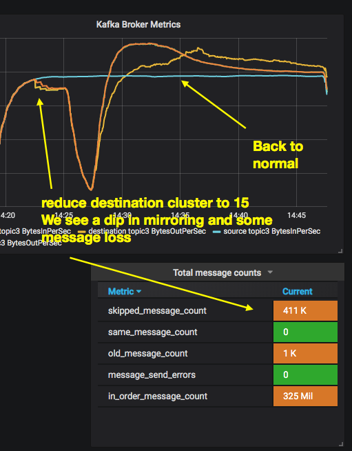

### Experiment: Downsize destination cluster permanently to 15 (take 2)

This time we repeat the experiment, only with half the amount of traffic. We replicate 100mb/s and not 200mb/s.
The results are much better. We don't see message loss and we do see brooklin recovering much faster.
Our assumption/guess is that when run under load it takes time for the workers to catch up and there's higher chance of things going wrong, when capacity is sufficient, there's lower chance of missing out on messages.

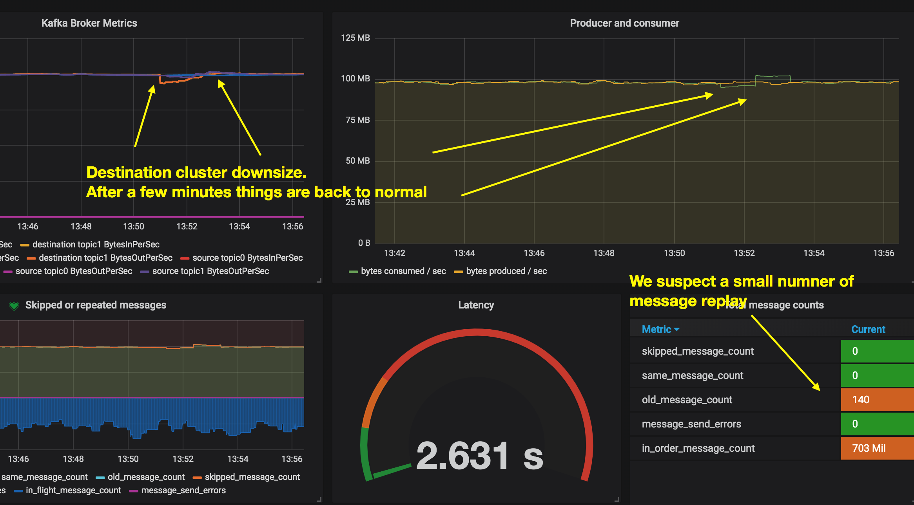


### Experiment: Add brooklin worker

The original setup has 32 brooklin workers. We want to see how adding an additional worker affects the cluster. Our expectation is that workers would rebalance and "continue as usual".

```sh
kubectl --context eu-west-1.k8s.local -n brooklin scale deployment brooklin --replicas 33
```

**Result:** As expected, everything is normal, that's good.

We see that the new worker joins the replication effort by looking at the network chart (as well as CPU load)

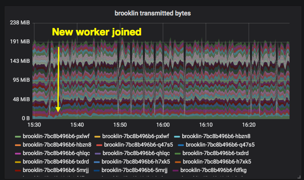

### Experiment: Remove brooklin worker

As before, the number of workers in our baseline is 32. In this experiment we reduce this number to 31. We expect to see no message loss but a small hiccup in latency until a rebalance occurs.

```sh
kubectl --context eu-west-1.k8s.local -n brooklin scale deployment brooklin --replicas 31
```

**Result:** We indeed see slowness but after a rebalance (~2 minutes) the rest of the workers catch up. No message loss.

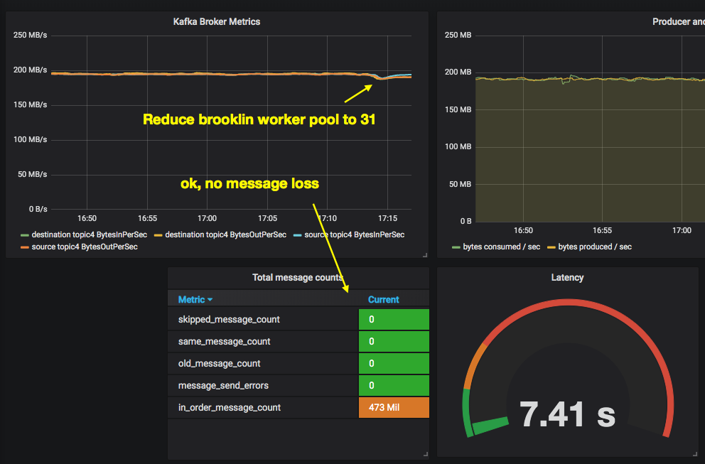

In this example we remove more and more workers:

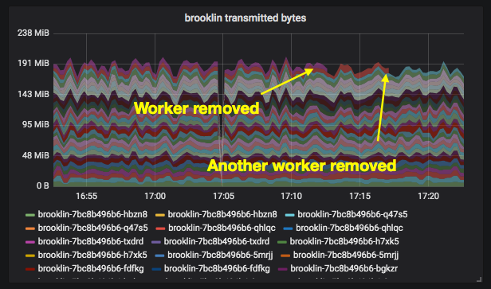
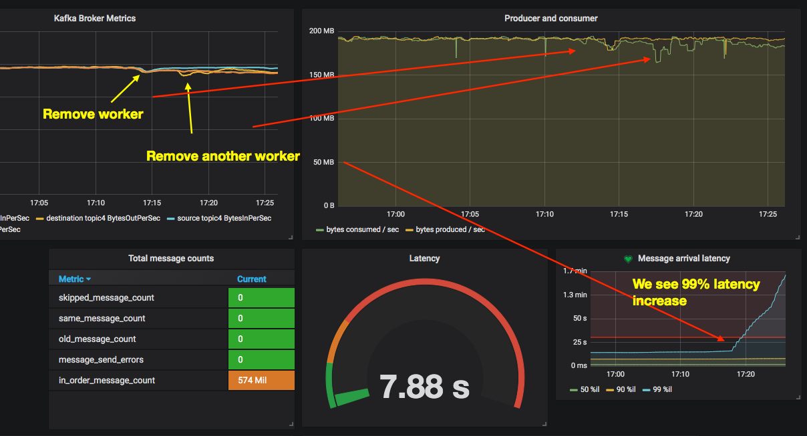

### Experiment: brooklin under capacity and then back to capacity

When removing more and more workers from brooklin at some point it will run out of capacity and will not be able to replicate in the desired throughput.

Our experiment is: Remove more and more workers (in this case it's sufficient to remove 2), have brooklin run out of capacity. And only then re-add workers and see how fast it's able to pick up with the pace.

Remove workers:

```sh
kubectl --context eu-west-1.k8s.local -n brooklin scale deployment brooklin --replicas 30
# Now wait
```

And then when you see it runs out of capacity start adding them again

```sh
kubectl --context eu-west-1.k8s.local -n brooklin scale deployment brooklin --replicas 32
```

**Result:** The result is not encouraging. We see some slowness in replication and then brookling catching up more or less. It does not catch up as fast as we hoped and probably as a result we see message loss, which we cannot entirely explain.

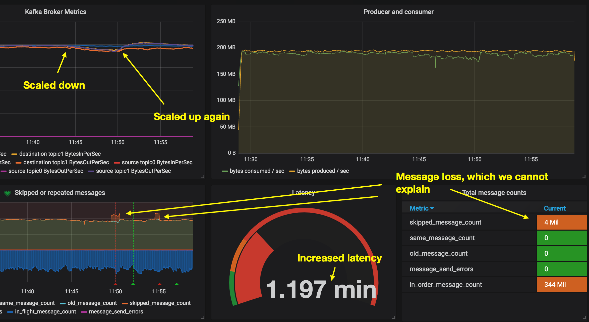

*We repeat this experiment, this time with **lower badwidth traffic**,* instead of 200Mb/s, we produce only 100Mb/s.

This time we slowly reduce the size of the brooklin cluster, one at a time every minute, until we start seeing it under capacity. The following code is in zsh:

```sh
for i in 31 30 29 28 27 26 25 25 24 23 22 21 20 19 18 17 16 15 14; do echo "Scaling down to $i..."; echo; kubectl --context eu-west-1.k8s.local -n brooklin scale deployment brooklin --replicas $i; sleep 60; done
```

Then after we start seeing capacity issues, we scale back up to 32.

```sh
kubectl --context eu-west-1.k8s.local -n brooklin scale deployment brooklin --replicas 32
```

**Result:** This time the result is much more encouraging. We see the slowness and then as soon as we add capacity brooklin catches up. And most importantly - no message loss!

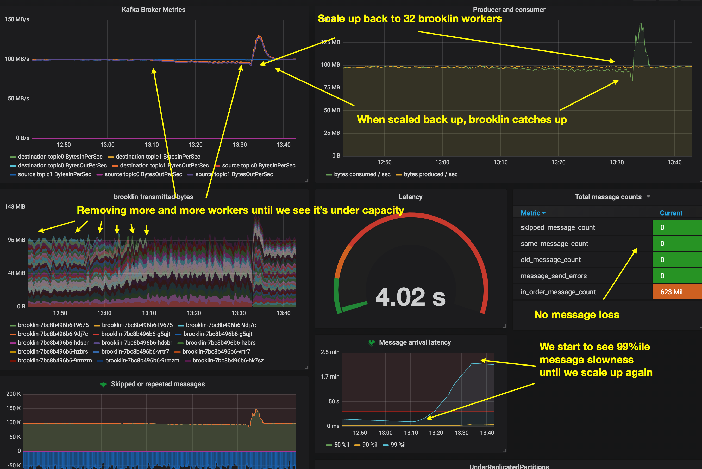

### Experiment: Add new topic

In this experiment we add a new topic and we want to find out how long does it take brooklin to discover it and fully replicate it.

A few words about the test setup. At the beginning of the entire test suite, we ask brooklin to replicate `topic.*`, e.g. all topics that start with the prefix `topic`, be them `topic0`, `topic1` etc. This is somewhat slower than explicitly asking brooklin to mirror just `topic1` but is easier in terms of test setup.

***Result:*** Discovery of new topic is in the order of 3-4 minutes, which is OK.

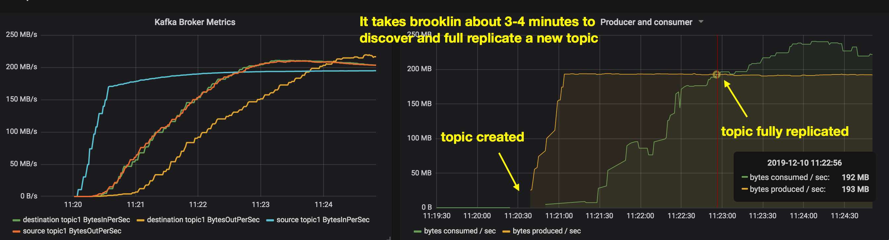

### Experiment: Add partitions to an existing topic

We want to test what happens when we repartition (e.g. add partitions) to an existing topic which is already being actively replicated.  We expect brooklin to pick up the new partitions and start replicating them as well.

We connect to one of the source cluster workers and run the `kafka-topics` command

```sh
$ make k8s-kafka-shell-source
# ... connecting to one of the brokers ...

$ unset JMX_PORT
# double the number of partitions. There were 64, up to 128:
$ bin/kafka-topics.sh --zookeeper  zookeeper:2181 --alter --topic topic1 --partitions 128
```

**Result:** This doesn't work quite as simple as that. What happens when we double the number of partitions on the source side is that all previous 64 partitions continue to be replicated, but all the new 64 partitions are not. This is due to the configuration we've made, which essentially tells brooklin to maintain partition identity by using the attribute `system.destination.identityPartitioningEnabled`

To fix that we add the same number of partitions to the destination cluster as well:

```sh
$ make k8s-kafka-shell-destination
# ... connecting ...

$ unset JMX_PORT
$ bin/kafka-topics.sh --zookeeper  zookeeper:2181 --alter --topic topic1 --partitions 128
```

Since we did that in the incorrect order, we lose data.

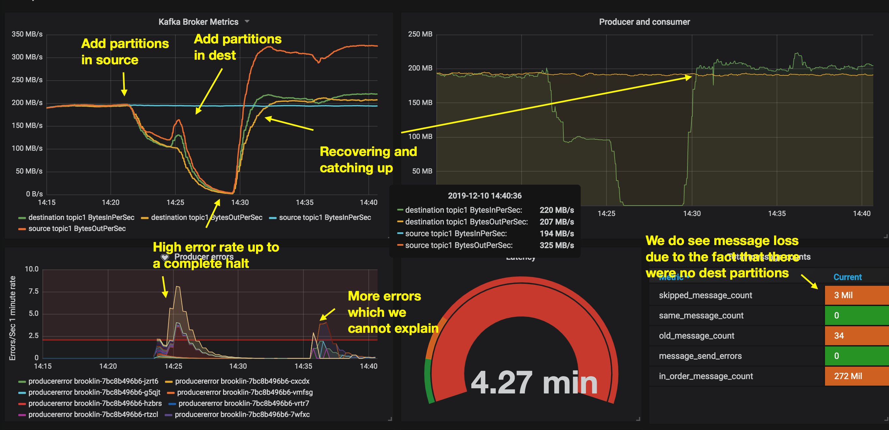

Let's try this again. 

### Experiment: Add partitions to an existing topic (take 2)

This time we do it in the right order. We first add the partitions to the destination cluster and only then to the source cluster.

**Result:** The result is much better, albeit not perfect. It takes brooklin several minutes to coordinate the replication of the new partitions but then it does and all seems normal. All except possibly some message loss that could be explained by the time it takes brooklin to discover and coordinate the replication of the new partitions (and the low retention time of 5min in kafka-source).

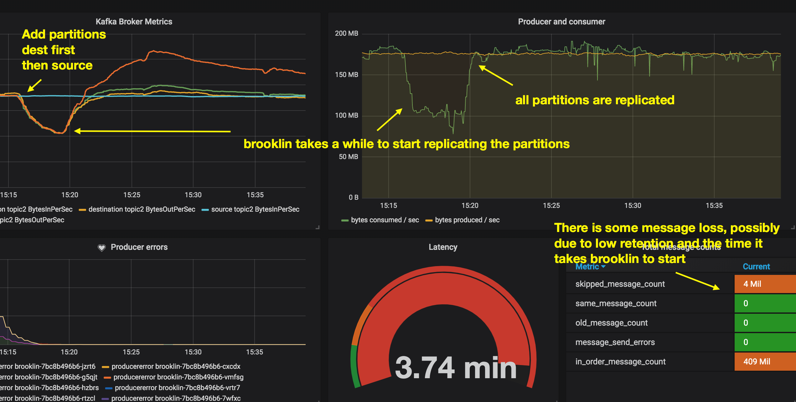

### Experiment: Packet loss: 10% on 3 brooklin workers (3 out of 32)

Since the main scenario we will deal with is replication over the Atlantic, we want to test by simulating packet loss. We use Weave Scopes' Traffic Control plugin in order to apply 10% packet loss on 3 out of 32 brooklin containers. 10% packet loss is quite high.

**Result:** We see slowness in processing and production errors reported by brooklin workers and then... Then things start going south... There's a storm of errors and brooklin behaves in a way we cannot explain. We see replication completely halts for several minutes (with errors in the log) and then resumes, and then halts again (with errors) and it takes it about 10 minutes to go back to normal.
Here are some of the error messages found in the logs (errors and warnings)

```text
WARN Detect exception being thrown from callback for src partition: topic3-16 while sending, metadata: Checkpoint: topic3/16/5251161, Topic: topic3, Partition: 16 , exception:  (com.linkedin.datastream.connectors.kafka.mirrormaker.KafkaMirrorMakerConnectorTask)
...

ERROR Sending a message with source checkpoint topic3/16/5251161 to topic topic3 partition 16 for datastream task mirror-topic.*_a0b9d65d-f164-4cb1-b5e5-38d08b8e07b5(kafkaMirroringC), partitionsV2=, partitions=[0], dependencies=[] threw an exception. (KafkaTransportProvider)
com.linkedin.datastream.common.DatastreamRuntimeException: org.apache.kafka.common.KafkaException: Producer is closed forcefully.
	at com.linkedin.datastream.kafka.KafkaProducerWrapper.generateSendFailure(KafkaProducerWrapper.java:251)
	...
```

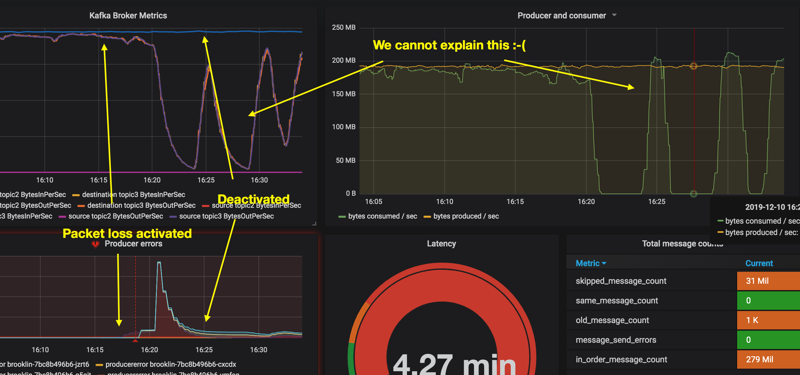

### Experiment: Packet loss: 10% on 3 brooklin workers (3 out of 32) take 2

We run the packet loss experiment once again, this time with 1/2 the amount of traffic, we replicate **100mb/s** and not 200mb/s.

Things are looking slightly better, but still not great.

Indeed during packet loss we see replication slowing down and brooklin production errors, which is expected. We also see errors in the logs, which is also expected.

However, after we disable packet loss we see a similar phenomenon as before, the workers start a rebalance, which brings replication to complete halt for about 2-3 minutes and then they go back to normal. Unlike previously, they do eventually go back to normal after a single rebalance cycle, which is at least encouraging.

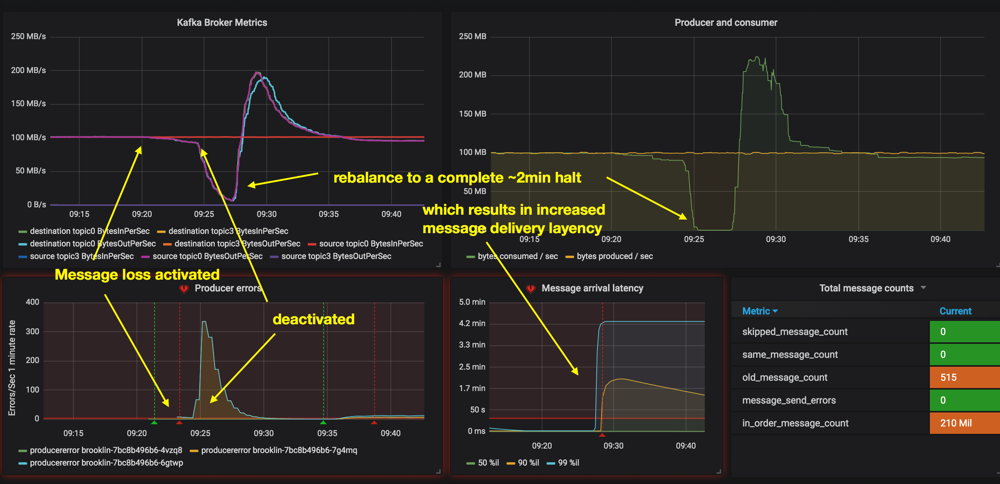


### Experiment: Packet loss: 10% on 1 broker in source cluster

The source cluster has 16 brokers. In this experiment we apply 10% packet loss on 1 of the brokers. This is similar to the previous experiment only that packet loss was implemented at the other end of the Atlantic.

**Result:** Seems OK. This time we tested with slightly lower traffic (160mb/s). We see slowness and when packets are back, the cluster catches up. We do notice some message loss but we're not sure that in this case it's something that brooklin could have done. It is probably a result of how the experiment was set up

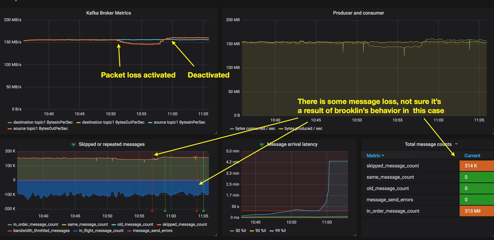

### Experiment: Packet loss: 10% on 1 broker in source cluster, take 2

We retry this experiment, this time with a shorter term packet loss. We activate package loss on a single broker *for 1 minute* and then stop.

**Result:** This time the results are great. Brooklin is able to catch up and indeed there's no message loss.

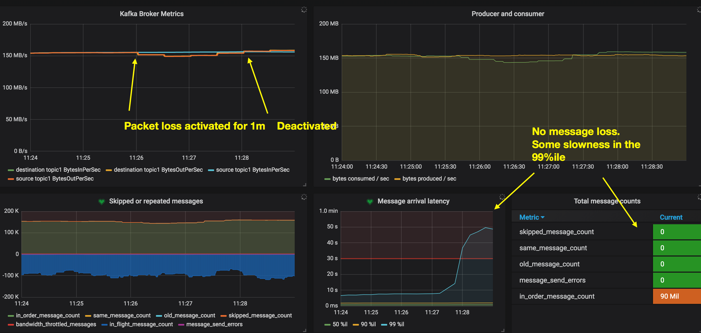

### Experiment: Packet loss: 10% on 1 broker in source cluster, take 3

We now run packet loss on **3 brokers** in the source cluster for about 1 minute as before.

**Result:** The result is OK. Brooklin is able to catch up and indeed there's no message loss.

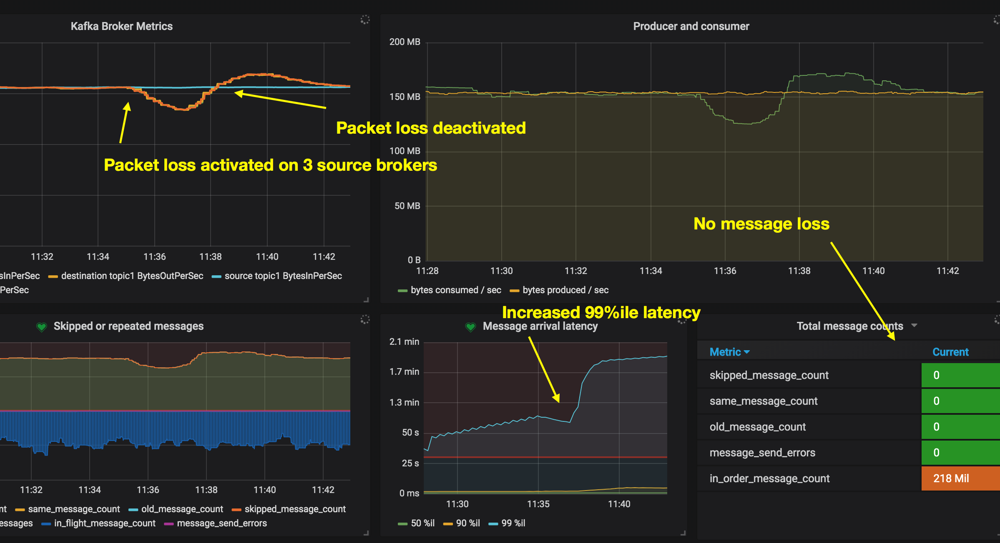

## Conclusion

Brooklin is a very useful tool, properly engineered and built with operations in mind. 
The main issue we see and that could be a deal breaker is its behavior when there's difficulty in the destination cluster. For example when brokers are flapping, network issues etc. It's OK for things to be slow during that time, the problem is that once the issues are fixed, brooklin takes a long time to recover, sometimes multiple cycles of rebalances, which is worrisome. 


### No message headers

One of the relatively recent features added to Kafka are message headers. As of this writing *brooklin does not support message headers*.
