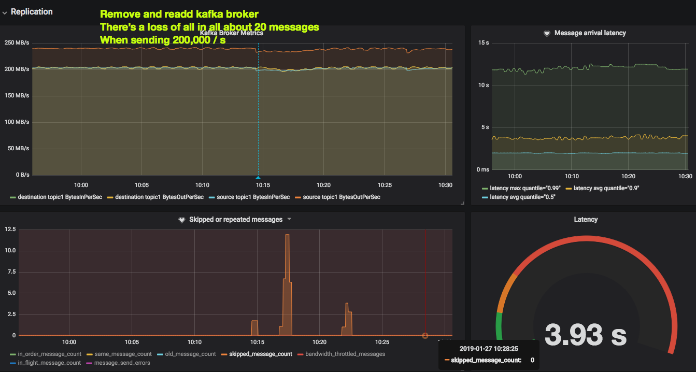
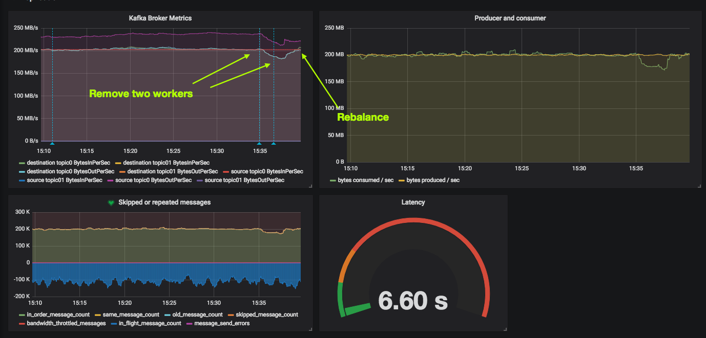
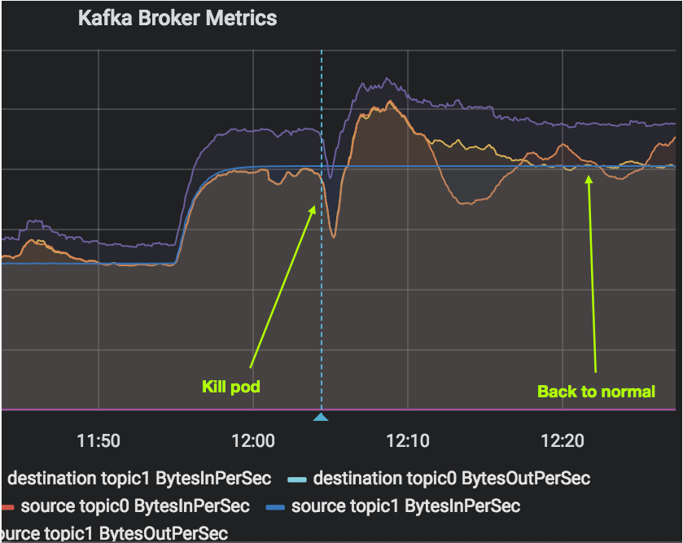
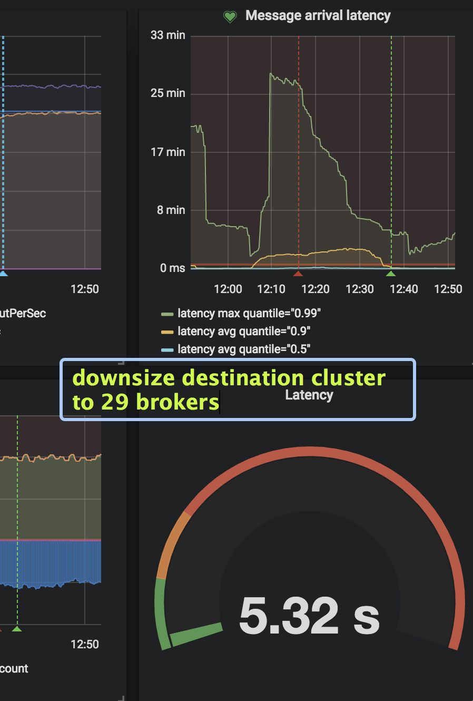
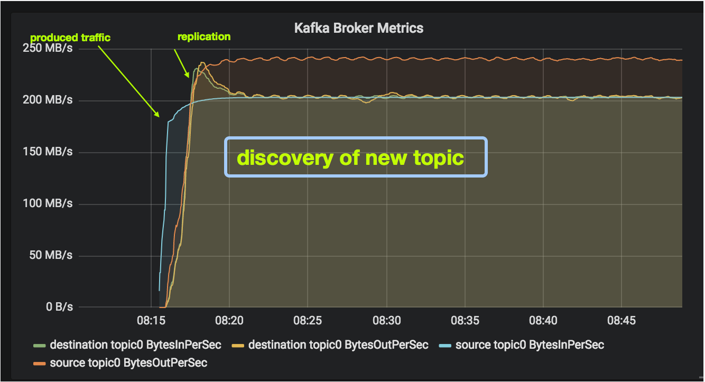
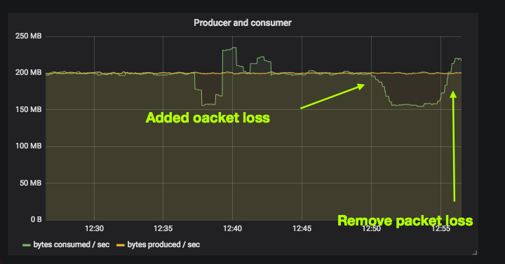
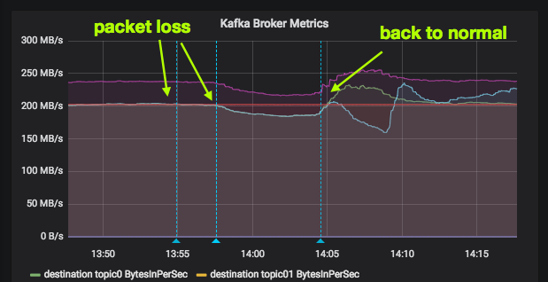

# Results of the experiment
In this experiment we set out to test the performance and correctless of uReplicator with two Kafka clusters located in two AWS regions: `us-east-1` (Virginia) and `eu-west-1` (Ireland).

To implement the experiment we created specialized producer and consumer written in Go. The producer's responsibility is to generate messages in predefined format and configurable throughput and the consumer's responsibility is to verify message arrival and measure throughput and latency.  
Details of the implementation of the producer and the consumer are in the [readme file](README.md).

## Setup
We use *Kubernetest* to spin up servers in both datacenters and set up the two kafka clusters as well as the uReplicator, producer and consumer.  

* The producer runs in us-east-1, producing data to the local cluster.
* uReplicator runs in eu-west-1, consuming from the cluster in us-east-1 and producing to the local kafka cluster in eu-west-1
* The consumer runs in eu-west-1, consuming messages replicated to the local cluster by uReplicator

We tested various and different configurations but most of the tests were run with this setup:

* Kubernetest node types: `i3-large`
* Kubernetest cluster sizes: in us-east-1: 40 nodes, in eu-west-1 48 nodes
* Kafka cluster sizes: 30 brokers in each cluster. Single zookeeper pod. Storage on ephemeral local disks
* uReplicator: 8 workers, 3 controllers
* Producer: 10 pods
* Consumer: 4 pods
* Produced messages: 1kB (1000 bytes) each message
* Production throughput: 200k messages/sec 
* => This results in replication of *200 MB/sec*
* Replicated topics by uReplicator: 1
* Kafka replication factor: 3 in us-east-1, 2 in eu-west-1
* Partitions: 150 partitions on both clusters as a baseline

(further configuration details such as memory, CPU allocation and more can be found in the k8s yaml files in this project)

## Results
We ran multiple experiments, here are the highlights

### Long haul 
Run the workload of 200MB/sec for several hours.  
**Result:** Looks good. Nothing suspicious happened. Over hours and hours the topics were correctly replicated. 

### Kill a broker in kafka-source
We kill a broker pod in kafka-source. When killed k8s automatically re-provisions a new pod in the statefulset, which results in a few minutes downtime for one of the brokers until it's back up. Since replication factor is 3 we do not expect message loss although this action might result in higher latency and lower throughput. 

Killing a pod: (example)

```
kubectl --context us-east-1.k8s.local -n kafka-source delete pod kafka-source-2
```

**Result:** We see a small hiccup in throughput and latency of replication. And some message loss (about 20 messages out of 200k/sec, 0.01%). We don't have an explanation to this message loss although in terms of correctly of our application this is definitely something we can live with. 




### Reduce source cluster size permanently to 29
The baseline of the source cluster is 30 brokers.  In this experiment we reduce the size to 29 permanently. Unlike the previous experiment in this case k8s will not re-provision the killed pod so the cluster size will remain 29 permanently. This is supposed to be OK since the replication factor is 3. 

Scaling down a cluster to 29:  

```
kubectl --context us-east-1.k8s.local -n kafka-source scale statefulset kafka-source --replicas 29
```

**Result:** the result is very similar to before. We see a slighy hiccup in replication throughput and in some cases we see minor message loss (which we cannot explain) but that's all. 

### Add uReplicator worker
The original setup had 8 uReplicator workers. We want to check how adding an additional worker affects the cluster. Our expectation is that workers would rebalance and "continue as usual". 

```
kubectl --context eu-west-1.k8s.local -n ureplicator scale deployment ureplicator-worker --replicas 9
```

**Result:** As expected, everything is normal, that's good. 

### Remove uReplicator worker
Simiar to before, the number of workers in our baseline is 8. In this test we reduce them to 7 by scaling down the number of pods. We expect to see no message loss but a small hiccup in latency until a rebalance. 

```
kubectl --context eu-west-1.k8s.local -n ureplicator scale deployment ureplicator-worker --replicas 7
```

**Result:** We indeed see slowness but after a rebalance (~2 minutes) the rest of the workers catch up. No message loss.



### uReplicaor under capacity and then back in capacity
When removing more and more workers from uReplicator at some stage it will run out of capacity and not be able to replicate in the desired throughput.  
Our experiment is: Remove more and more workers, have uReplicator run out of capacity. And only then re-add workers and see how fast it's able to pick up with the pace. 

Remove more and more workers: 

```
kubectl --context eu-west-1.k8s.local -n ureplicator scale deployment ureplicator-worker --replicas 7
kubectl --context eu-west-1.k8s.local -n ureplicator scale deployment ureplicator-worker --replicas 6
kubectl --context eu-west-1.k8s.local -n ureplicator scale deployment ureplicator-worker --replicas 5
...

```

And then when you see it runs out of capacity start adding them again

```
kubectl --context eu-west-1.k8s.local -n ureplicator scale deployment ureplicator-worker --replicas 6
```

It takes a long time for wokrers to catch up with work but eventually they do. Around 10 minutes
Sometimes uReplicaotr needs to "get kicked" by adding or removing workers. For example we see that with 10 wokrers it might get to a local minima and then when reduced to 8 workers it suddenly gets a boost. It seems that sometimes the controllers don't know about the newly added workers. This can be monitored and fixed looking into the `/instances` API on the controller.

### Kill a broker in kafka-source
We abruptly kill one of the brokers, allowing k8s to re-provision a new pod into its statefulset. We expect no message loss (as there's a replication factor of 3) and perhaps a slight performance hiccup. 

```
kubectl --context eu-west-1.k8s.local -n kafka-destination delete pod kafka-destination-29
```

**Result:** There's a small hiccup and then things are back to normal. No message loss



### Delete a pod on kafka-destination
The baseline of both kafka clusters is 30 brokers. In this experiment we delete one broker from the destination cluster. We expect no message loss (as there's a replication factor of 3) and perhaps a slight performance hiccup. 

```
kubectl --context eu-west-1.k8s.local -n kafka-destination scale statefulset kafka-destination --replicas 29
```

**Result:** OK, no noticable hiccups

 

### Adding new topic
In this experiment we add a new topic and we want to see how fast uReplicator starts replicating the new topic. 

***Result:*** Discovery of new topic is in the order of 2-3 minutes, which is OK.



### Adding partitinos to an existing topic
We want to test what happens when we repartition (e.g. add partitions) to an existing topic which is already being actively replicated.  We expect uReplicator to pick up the new partitions and start replicating them as well. 

We connect to one of the source cluster workers and run the `kafka-topics` command

```
$ make k8s-kafka-shell-source
# ... connecting ... 

$ unset JMX_PORT 
$ bin/kafka-topics.sh --zookeeper  zookeeper:2181 --alter --topic topic5 --partitions 300
```

**Result:** This was a bit of a surprise, but uReplicator did not pick up the new partitions. It continued replicating the old partitions but did not pick up the new partitions. 

To fix that we use uReplicator's API. We delete the topic from uReplicator and then re-add it and then uReplicator finally starts replicating the new partitions. This seems like a usability issue, not sure if this is by design. 

In order to send commands to the remote uReplicator controller(s) we open a local port with port-forwarding:

```
kubectl --context eu-west-1.k8s.local -n ureplicator port-forward  ureplicator-controller-76ff85b889-l9mzl 9000
```

And now we can delete and recrete the topic with as many partitions as we should

```
curl -X DELETE http://localhost:9000/topics/topic5
curl -X POST -d '{"topic":"topic5", "numPartitions":"300"}' http://localhost:9000/topics
```

### Add uReplicator controller
We try adding a new controller to make sure nothing breaks while doing so. 

**Result:** Looks good, continues operation as normal. 

### Delete uReplicator controller
We delete a uReplicator controller (there were 3 to begin with) and make sure the rest of the controllers are able to continue operation as planned.

**Result:** Looks good, the rest of the controllers behave normally

### Delete all uReplicator controllers
We delete all uReplicator controllers to see what happens.

**Result:** For as long as there's no controller alive the workers continue their normal operation. However new topics will not are not getting replicated. When controllers are back up they pick up the information about the existing workers and they take charge again of tpoic replication control. 

### Packet loss: 10% on 4 replicator workers (out of 10)
Since the main scenario we will deal with is replication over the atlantic we want to test by simulating packet loss. We use Weave Scopes' Traffic Control plugin in order to apply 10% packet loss on 4 out of 10 uReplicator workers. 10% packet loss is quite high. 

**Result:** We see slowness in processing, but no message loss. That's good. 



### Packet loss: 10% on 4 brokers in source cluster
The source cluster has 30 nodes. In this experiment we apply 10% packet loss on 4 of the brokers. This is similar to the previous experiment only that packet loss was implemented at the other end of the atlantic. 

**Result:** ok, we see slowness and when packets are back, the cluster catches up. 




## Conclusion
All in all uReplicator seems like a capable tool for the mission at hand. There are still a few blind spots and hiccups but all in all, it seems ready to go. 

### No message headers
One of the relatively recent features added to Kafka are message headers. As of this writing *uReplicator does not support message headers*, meaning that if a message contains a header uReplicator would replicate the message, silently discarding its headers. 